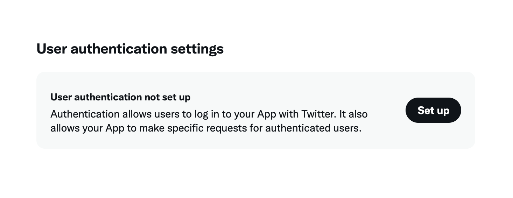
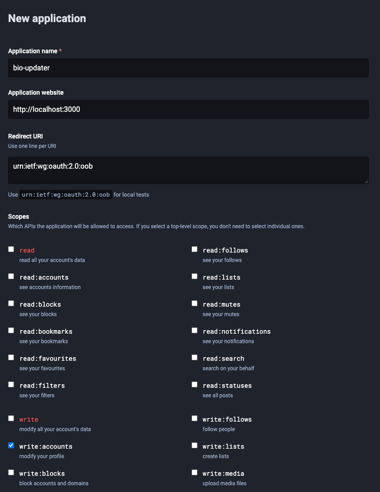

CLI script for updating bio at Twitter and GitHub in one go.

Unfortunately a bit tricky to set up.


## Setup

All the services are optional. If you don't add proper keys to `.env` file, it will be skipped in runtime.

### Twitter

1. Create Twitter Developer portal app https://developer.twitter.com/en/portal/dashboard.
1. Save consumer key and consumer secret to `.env` file as `TWITTER_CONSUMER_KEY` and `TWITTER_CONSUMER_SECRET`.
1. Set up authentication in order to give your app read/write permissions (default is read only). You can put `http://localhost:3000/callback` as callback URL and `https://example.org` as the website. 

### GitHub

1. Create an access token https://github.com/settings/tokens?type=beta and save it to `.env` as `GITHUB_BEARER_TOKEN`.

### Mastodon

1. Create app in settings `https://YOUR_INSTANCE/settings/applications` . Only `write:accounts` permission is needed, not even any `read`.
1. Save `Your access token` and add it as `MASTODON_BEARER_TOKEN` to `.env`.

## Run

```bash
source .env
node index.mjs
```

You will be asked to visit Twitter authentication page where you will get PIN to paste into the app.

## Possibly in future

- [LinkedIn](https://learn.microsoft.com/en-us/linkedin/shared/integrations/people/profile-edit-api)
- [YouTube](https://developers.google.com/youtube/v3/docs/channels/update)

## Not possible as of now

No API with this feature.

- Instagram
